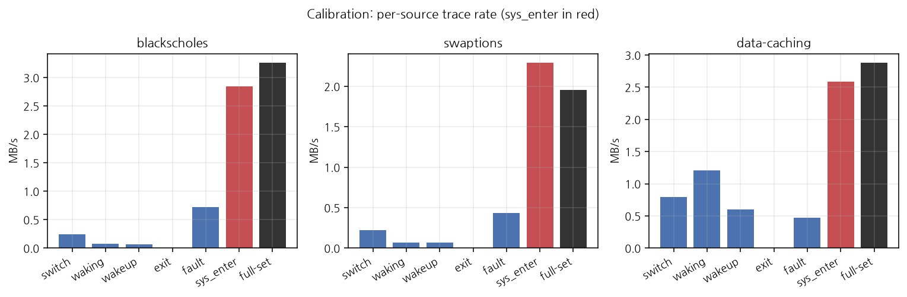
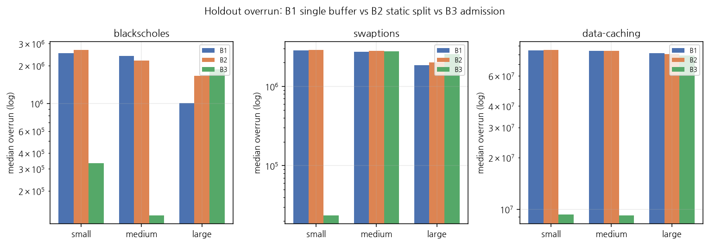
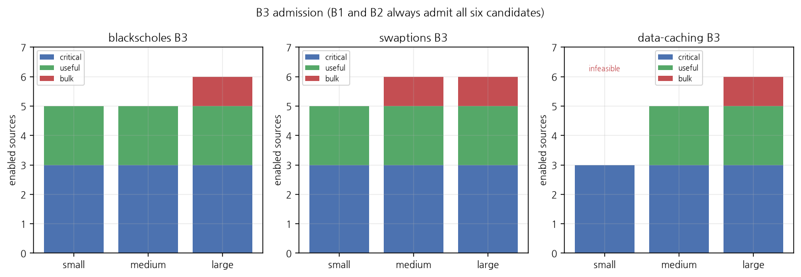
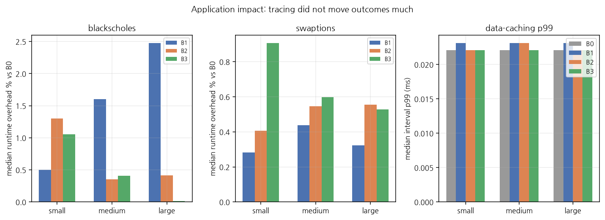
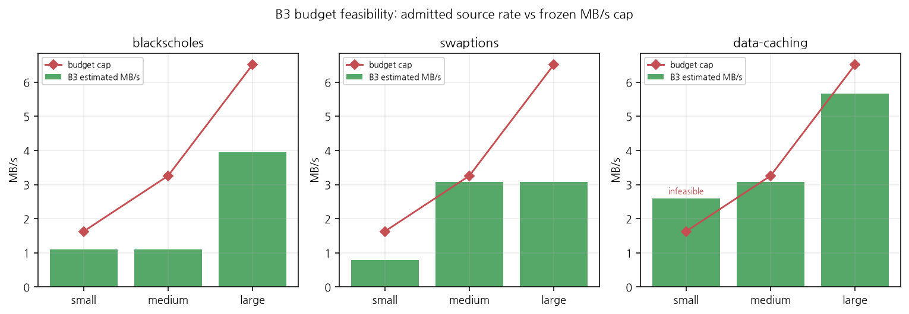

# TraceArbiter does not make full tracing cheaper. It decides when full tracing is not affordable.

**Workload-calibrated trace admission under finite ftrace buffer capacity.**

TraceArbiter is a C++20 Linux **trace admission controller**. It
measures the real rate of ftrace sources on the target workload,
then admits or excludes them under a declared ring-buffer / MB/s
budget. Complementary to CounterBouncer; not a rewrite or vNext.

On this host the active constraint was **trace bandwidth/capacity,
not target CPU overhead.**

## Problem

Linux already exposes many ftrace sources. They compete for a
finite per-CPU ring buffer. When producers outpace that buffer in
overwrite mode, the kernel counts `overrun` (events overwritten).
`dropped events` is the discard counter when overwrite is off; this
campaign saw `dropped=0` with `overrun>0`, which matches overwrite
mode.

The question is not "how do I trace cheaper." It is **which sources
may enter a buffer that cannot hold everything.**

## One-line solution

Calibrate each candidate's real MB/s, then lexicographically admit
`critical`, then `useful`, then `bulk` until the budget is full.
If critical sources alone exceed the budget, say so
(`CRITICAL_SOURCES_EXCEED_BUDGET`) and still keep them.

## What TraceArbiter is not

- Not a profiler, flame-graph UI, or dashboard.
- Not a custom ring buffer or a new tracing kernel.
- Not an eBPF-primary or LLM diagnosis tool.
- Not a demonstration that multi-instance **buffer partitioning**
  is a universal win. Holdout did not support that.

It uses existing tracefs primitives: instances, event enable files,
buffer size, and buffer stats. Instances are an apply mechanism,
not the result.

## Why "trace everything" is not free

More sources raise ring-buffer pressure. On this host they barely
raised wall time. Full-set calibration overhead vs B0:

| Workload | Overhead | Full-set bytes/s |
|---|---:|---:|
| blackscholes | +0.240% | 3,415,008 |
| swaptions | +0.392% | 2,052,286 |
| data-caching | +0.001% | 3,016,342 |

The planner's overhead cap was therefore not binding. The MB/s cap
was.

## Architecture


Priorities are user-declared (`critical` / `useful` / `bulk`), not
ML. The first-class decision is **ADMIT / EXCLUDE**. Optional
buffer partition is how an admitted set is placed on kernel
instances.

## Real workloads

Holdout `native-holdout-v1` on Intel Core i9-14900K, kernel
7.0.0-28-generic, 32 logical CPUs. PARSEC pinned `taskset -c
2,4,6,8`. **165 / 165** cells OK, 5 reps.

| Workload | Kind | Run |
|---|---|---|
| `blackscholes` | PARSEC native | 4 threads, `in_10M.txt` |
| `swaptions` | PARSEC native | `-ns 128 -sm 1000000 -nt 4` |
| `data-caching` | CloudSuite Docker | 30 s, 100k offered RPS |

Published git history is the source layout. It is **not** the SHA
that executed the 165 holdout runs. Those ran from a local
snapshot; checksums stay under local `artifacts/provenance/`.

## Calibration

`raw_syscalls:sys_enter` dominates volume (~2.4–3.0 MB/s). Signed
per-source overheads are often negative (noise, not clamped zeros).



## Baselines (B2 is the control)

Frozen after calibration. Weights were not retuned after holdout.

| Name | Source set | Buffer |
|---|---|---|
| B0 | none | — |
| **B1** | all six | one instance, same `buffer_kb` |
| **B2** | all six | static 70% / 30% critical / bulk **split** |
| **B3** | admitted subset | remaining budget, split only if bulk is in |
| REF | critical only | 65536 KB/CPU. Not ground truth |

| Budget | buffer_kb | max MB/s | max overhead % |
|---|---:|---:|---:|
| small | 256 | 1.628 | 0.250 |
| medium | 2048 | 3.257 | 0.375 |
| large | 16384 | 6.514 | 0.875 |

B1 vs B2 holds the source set fixed and changes only partitioning.
B3 is allowed to **exclude** sources.

## Results

Primary evidence: kernel `stats` **overrun**, who was admitted, and
whether the plan was feasible. Snapshot count / REF is **not** an
accuracy metric (REF overruns on data-caching; blackscholes B3
large is 3.55× REF because extra sources changed sched traffic).

### Partitioning does not win (source set fixed)

Median overrun, n=5. B1 and B2 always admit all six sources.

| Workload | Budget | B1 (single) | B2 (static split) | B2 vs B1 |
|---|---|---:|---:|---|
| blackscholes | small | 2,505,416 | 2,662,293 | worse |
| blackscholes | medium | 2,389,941 | 2,199,687 | ~same |
| blackscholes | large | 1,004,742 | 1,664,378 | worse |
| swaptions | small | 2,832,425 | 2,866,069 | ~same |
| swaptions | medium | 2,730,879 | 2,799,180 | ~same |
| swaptions | large | 1,843,095 | 2,005,440 | worse |
| data-caching | small | 84,429,583 | 84,892,596 | ~same |
| data-caching | medium | 84,232,579 | 84,038,564 | ~same |
| data-caching | large | 81,363,762 | 80,234,327 | ~same |

When every source is admitted, a static split is not a consistent
improvement. A single larger buffer is sometimes better
(blackscholes large).

### Admission does win (B3 drops `sys_enter`)

| Workload | Budget | B3 set | B1 | B2 | B3 | B1/B3 |
|---|---|---|---:|---:|---:|---:|
| blackscholes | medium | no sys_enter | 2,389,941 | 2,199,687 | 126,839 | 18.8× |
| swaptions | small | no sys_enter | 2,832,425 | 2,866,069 | 23,408 | 121× |
| data-caching | medium | no sys_enter | 84,232,579 | 84,038,564 | 9,169,708 | 9.2× |
| data-caching | small | critical only, **infeasible** | 84,429,583 | 84,892,596 | 9,329,201 | 9.1× |

The 9×–121× drop is **not** "the allocator got smarter." It is
**not admitting the high-rate bulk source.** B2 keeps `sys_enter`
and does not get that drop.

### Put `sys_enter` back and the gap closes

| Workload | Budget | B3 set | B1 | B2 | B3 |
|---|---|---|---:|---:|---:|
| blackscholes | large | all six | **1,004,742** | 1,664,378 | 1,868,815 |
| swaptions | medium | all six | 2,730,879 | 2,799,180 | 2,746,747 |
| data-caching | large | all six | 81,363,762 | 80,234,327 | 78,720,800 |

Same source set + partitioned buffers: no lasting B3 advantage.
blackscholes large B3 is **1.86× worse** than B1.

data-caching small B3: estimated 2.60 MB/s vs cap 1.63 MB/s,
`CRITICAL_SOURCES_EXCEED_BUDGET`. Critical three stay enabled.
Overrun is still 9,329,201 — infeasible was reported, not hidden,
and critical admission is not the same as "signals preserved."






PARSEC wall-time overhead 0–2.5% (noise). CloudSuite wall time is
the 30 s timeout; p99 stays 0.0221–0.0231 ms.

Tables: `docs/results.md`. Method: `docs/methodology.md`.

## Negative results

- Initial design expected **source selection and buffer
  partitioning** to both improve fidelity. Holdout supported
  admission. It did not support partitioning as a consistent
  optimization.
- CPU overhead was not the binding constraint here.
- REF is not lossless: data-caching REF overrun 2,485,957 at
  65536 KB/CPU.
- Snapshot retention vs REF is not an oracle.
- Additive per-source MB/s overestimates the full set (swaptions
  `sys_enter` 2.40 MB/s vs full-set 2.05 MB/s).

## Reproduce

Tracefs on this host is a group grant via
`scripts/setup_host.sh --apply` (not chmod 777). Vendor PARSEC /
CloudSuite binaries come from MetricTrust `vendor/`.

```sh
python3 -m venv .venv
.venv/bin/pip install cmake matplotlib
.venv/bin/cmake -S . -B build
.venv/bin/cmake --build build
.venv/bin/ctest --test-dir build --output-on-failure
./build/tracearbiter preflight
python3 analysis/analyze.py
.venv/bin/python analysis/plots.py
python3 scripts/record_provenance.py
```

Do not retune `configs/budgets/*.yaml` after looking at holdout.
CI runs unit tests only; no hardware ftrace.

## Limitations

- Single host. No CXL, no multi-socket study.
- User-declared priorities are a diagnosis goal.
- CloudSuite runtime overhead is uninformative (fixed 30 s).
- Holdout execution SHA is local, not this git history.
- TraceArbiter does not diagnose root cause.

## Position relevance

C++20, ftrace/tracefs, ring-buffer accounting, and a measured
admission policy under a real capacity budget — complementary to
CounterBouncer's PMU validity work.

## Sources

`docs/sources.md`. Kernel `overrun` / `dropped` definition: Linux
ftrace documentation.
